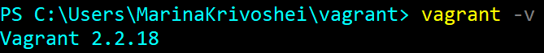

# Домашнее задание к занятию "5.2. Применение принципов IaaC в работе с виртуальными машинами"

## Как сдавать задания

Обязательными к выполнению являются задачи без указания звездочки. Их выполнение необходимо для получения зачета и диплома о профессиональной переподготовке.

Задачи со звездочкой (*) являются дополнительными задачами и/или задачами повышенной сложности. Они не являются обязательными к выполнению, но помогут вам глубже понять тему.

Домашнее задание выполните в файле readme.md в github репозитории. В личном кабинете отправьте на проверку ссылку на .md-файл в вашем репозитории.

Любые вопросы по решению задач задавайте в чате учебной группы.

---

## Задача 1

- Опишите своими словами основные преимущества применения на практике IaaC паттернов.

Ускорение производства и вывода продукта на рынок, быстрая и эффективная разработка.
Стабильность среды, устранение дрейфа конфигураций
Польза от использования шаблонов состоит в снижении сложности разработки за счёт готовых абстракций для решения целого класса проблем.

- Какой из принципов IaaC является основополагающим?

Идемпоте́нтность  - это свойство объекта или операции, при повторном выполнении которой мы получаем результат идентичный предыдущему и всем последующим выполнениям.

## Задача 2

- Чем Ansible выгодно отличается от других систем управление конфигурациями?
- 
Скорость – быстрый старт на текущей SSH инфраструктуре.

Простота – декларативный метод описания конфигураций.

Расширяемость —лёгкое подключение кастомных ролей и модулей.
- Какой, на ваш взгляд, метод работы систем конфигурации более надёжный push или pull?

В режиме Pull сам агент LCM на сервере по расписанию сравнивает свою конфигурацию с конфигурацией, опубликованной в общем хранилище конфигураций. Если имеются изменения, то конфигурация копируется локально и применяется. Таким образом мы убираем возможность  «человеческого фактора», потому что в режиме Push мы вручную или скриптом запускаем процесс применения изменений на сервере.
Поэтому я считаю, что Pull является более надежным.


## Задача 3

Установить на личный компьютер:

- VirtualBox

- Vagrant


- Ansible


*Приложить вывод команд установленных версий каждой из программ, оформленный в markdown.*

## Задача 4 (*)

Воспроизвести практическую часть лекции самостоятельно.

- Создать виртуальную машину.
- Зайти внутрь ВМ, убедиться, что Docker установлен с помощью команды
```
docker ps
```
