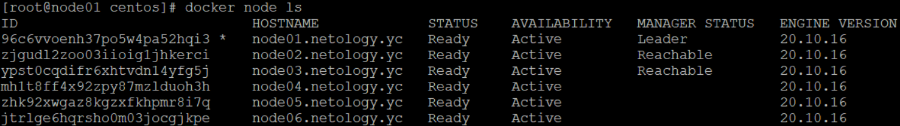
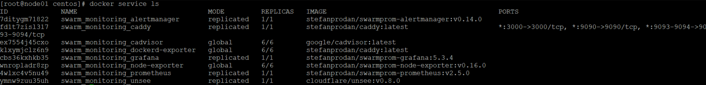

# Домашнее задание к занятию "5.5. Оркестрация кластером Docker контейнеров на примере Docker Swarm"

## Как сдавать задания

Обязательными к выполнению являются задачи без указания звездочки. Их выполнение необходимо для получения зачета и диплома о профессиональной переподготовке.

Задачи со звездочкой (*) являются дополнительными задачами и/или задачами повышенной сложности. Они не являются обязательными к выполнению, но помогут вам глубже понять тему.

Домашнее задание выполните в файле readme.md в github репозитории. В личном кабинете отправьте на проверку ссылку на .md-файл в вашем репозитории.

Любые вопросы по решению задач задавайте в чате учебной группы.

---

## Задача 1

Дайте письменые ответы на следующие вопросы:

- В чём отличие режимов работы сервисов в Docker Swarm кластере: replication и global?

replication - настраиваемое распространение микросервиса на докер ноды 

global - распространение микросервиса на ВСЕ ноды

- Какой алгоритм выбора лидера используется в Docker Swarm кластере?

используется алгоритм поддержания распределенного консенсуса — Raft. В кластере могут одновременно работать несколько управляющих нод, которые могут в любой момент заменить вышедшего из строя лидера.

- Что такое Overlay Network?

Overlay-сети используются в контексте Docker Swarm, где виртуальная сеть, которую используют контейнеры, связывает несколько физических хостов, на которых запущен Docker. Когда вы запускаете контейнер на swarm-кластере (как часть сервиса), множество сетей присоединяется по умолчанию, и каждая из них соответствует разным требованиям связи. 


## Задача 2

Создать ваш первый Docker Swarm кластер в Яндекс.Облаке

Для получения зачета, вам необходимо предоставить скриншот из терминала (консоли), с выводом команды:
```
docker node ls
```



## Задача 3

Создать ваш первый, готовый к боевой эксплуатации кластер мониторинга, состоящий из стека микросервисов.

Для получения зачета, вам необходимо предоставить скриншот из терминала (консоли), с выводом команды:
```
docker service ls
```


## Задача 4 (*)

Выполнить на лидере Docker Swarm кластера команду (указанную ниже) и дать письменное описание её функционала, что она делает и зачем она нужна:
```
# см.документацию: https://docs.docker.com/engine/swarm/swarm_manager_locking/
docker swarm update --autolock=true
```

