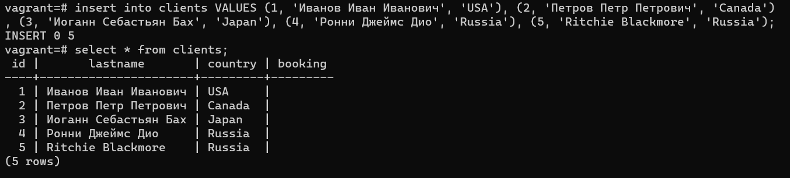

# Домашнее задание к занятию "6.2. SQL"

## Введение

Перед выполнением задания вы можете ознакомиться с 
[дополнительными материалами](https://github.com/netology-code/virt-homeworks/tree/master/additional/README.md).

## Задача 1

Используя docker поднимите инстанс PostgreSQL (версию 12) c 2 volume, 
в который будут складываться данные БД и бэкапы.

Приведите получившуюся команду или docker-compose манифест.


## Задача 2

В БД из задачи 1: 
- создайте пользователя test-admin-user и БД test_db

CREATE DATABASE test_db;


CREATE ROLE "test-admin-user" SUPERUSER NOCREATEDB NOCREATEROLE NOINHERIT LOGIN;


- в БД test_db создайте таблицу orders и clients (спeцификация таблиц ниже)

- предоставьте привилегии на все операции пользователю test-admin-user на таблицы БД test_db


- создайте пользователя test-simple-user  

- предоставьте пользователю test-simple-user права на SELECT/INSERT/UPDATE/DELETE данных таблиц БД test_db


Таблица orders:
- id (serial primary key)
- наименование (string)
- цена (integer)

Таблица clients:
- id (serial primary key)
- фамилия (string)
- страна проживания (string, index)
- заказ (foreign key orders)

Приведите:
- итоговый список БД после выполнения пунктов выше,

- описание таблиц (describe)

- SQL-запрос для выдачи списка пользователей с правами над таблицами test_db

 select * from INFORMATION_SCHEMA.TABLE_PRIVILEGES where grantee in ('test-admin-user', 'test-simple-user');

- список пользователей с правами над таблицами test_db


## Задача 3

Используя SQL синтаксис - наполните таблицы следующими тестовыми данными:

Таблица orders

|Наименование|цена|
|------------|----|
|Шоколад| 10 |
|Принтер| 3000 |
|Книга| 500 |
|Монитор| 7000|
|Гитара| 4000|


Таблица clients

|ФИО|Страна проживания|
|------------|----|
|Иванов Иван Иванович| USA |
|Петров Петр Петрович| Canada |
|Иоганн Себастьян Бах| Japan |
|Ронни Джеймс Дио| Russia|
|Ritchie Blackmore| Russia|


Используя SQL синтаксис:
- вычислите количество записей для каждой таблицы 
- приведите в ответе:
    - запросы 
    - результаты их выполнения.
  


## Задача 4

Часть пользователей из таблицы clients решили оформить заказы из таблицы orders.

Используя foreign keys свяжите записи из таблиц, согласно таблице:

|ФИО|Заказ|
|------------|----|
|Иванов Иван Иванович| Книга |
|Петров Петр Петрович| Монитор |
|Иоганн Себастьян Бах| Гитара |

Приведите SQL-запросы для выполнения данных операций.


Приведите SQL-запрос для выдачи всех пользователей, которые совершили заказ, а также вывод данного запроса.

select * from clients as c where  exists (select id from orders as o where c.booking = o.id);

 
Подсказка - используйте директиву `UPDATE`.

## Задача 5

Получите полную информацию по выполнению запроса выдачи всех пользователей из задачи 4 
(используя директиву EXPLAIN).


Приведите получившийся результат и объясните что значат полученные значения.

cost - затратность операции

0.00 — затраты на получение первой строки.

18.10 — затраты на получение всех строк.

rows — приблизительное количество возвращаемых строк при выполнении операции Seq Scan.

width — средний размер одной строки в байтах.

## Задача 6

Создайте бэкап БД test_db и поместите его в volume, предназначенный для бэкапов (см. Задачу 1).

 sudo docker exec -i sql-netology pg_dump -U vagrant test_db -f /var/lib/postgresql/data/dump_test.sql


Остановите контейнер с PostgreSQL (но не удаляйте volumes).


Поднимите новый пустой контейнер с PostgreSQL.

sudo docker run --rm --name vagrant-netology-2 -e POSTGRES_PASSWORD=vagrant -e POSTGRES_USER=vagrant -e POSTGRES_DB=vagrant -d -ti -p 5432:5432 -v vol1:/var/lib/postgresql/data -v vol2:/var/lib/postgresql postgres:12


Восстановите БД test_db в новом контейнере.


Приведите список операций, который вы применяли для бэкапа данных и восстановления. 

```html 
vagrant=# drop database test_db;
DROP DATABASE
vagrant=# create database test_db;
CREATE DATABASE
vagrant=# \q
root@05caac2b34e6:/# psql -U vagrant -d test_db -f /var/lib/postgresql/data/dump_test.sql;
SET
SET
SET
SET
SET
 set_config
------------

(1 row)

SET
SET
SET
SET
root@05caac2b34e6:/#  psql -U vagrant
psql (12.11 (Debian 12.11-1.pgdg110+1))
Type "help" for help.

vagrant=# \l
                               List of databases
   Name    |  Owner  | Encoding |  Collate   |   Ctype    |  Access privileges
-----------+---------+----------+------------+------------+---------------------
 postgres  | vagrant | UTF8     | en_US.utf8 | en_US.utf8 |
 template0 | vagrant | UTF8     | en_US.utf8 | en_US.utf8 | =c/vagrant         +
           |         |          |            |            | vagrant=CTc/vagrant
 template1 | vagrant | UTF8     | en_US.utf8 | en_US.utf8 | =c/vagrant         +
           |         |          |            |            | vagrant=CTc/vagrant
 test_db   | vagrant | UTF8     | en_US.utf8 | en_US.utf8 |
 vagrant   | vagrant | UTF8     | en_US.utf8 | en_US.utf8 |
(5 rows)
```


---

### Как cдавать задание

Выполненное домашнее задание пришлите ссылкой на .md-файл в вашем репозитории.

---
