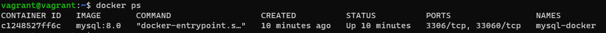
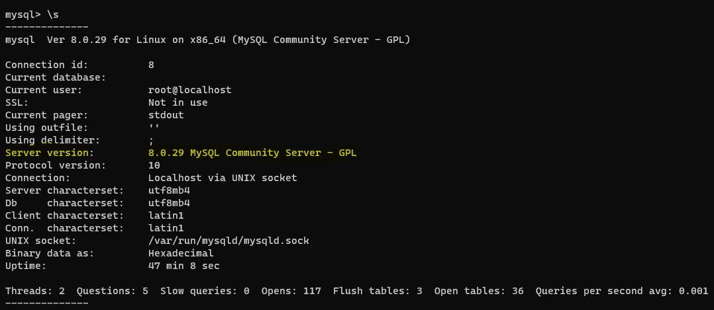

# Домашнее задание к занятию "6.3. MySQL"

## Введение

Перед выполнением задания вы можете ознакомиться с 
[дополнительными материалами](https://github.com/netology-code/virt-homeworks/tree/master/additional/README.md).

## Задача 1.

Используя docker поднимите инстанс MySQL (версию 8). Данные БД сохраните в volume.

```html
vagrant@vagrant:~$ sudo docker pull mysql:8.0
vagrant@vagrant:~$ sudo docker volume create vol_mysql
vol_mysql
vagrant@vagrant:~$ sudo docker run --rm --name mysql-docker -e MYSQL_ROOT_PASSWORD=mysql -ti -p 3306:3306 -v vol_mysql:/etc/mysql/ mysql:8.0
```



Изучите [бэкап БД](https://github.com/netology-code/virt-homeworks/tree/master/06-db-03-mysql/test_data) и 
восстановитесь из него.

Перейдите в управляющую консоль `mysql` внутри контейнера.

Используя команду `\h` получите список управляющих команд.

Найдите команду для выдачи статуса БД и **приведите в ответе** из ее вывода версию сервера БД.



Подключитесь к восстановленной БД и получите список таблиц из этой БД.

``` html
mysql> show tables;
+-------------------+
| Tables_in_test_db |
+-------------------+
| orders            |
+-------------------+
1 row in set (0.00 sec)
```

**Приведите в ответе** количество записей с `price` > 300.

``` html

mysql> SELECT * FROM orders WHERE `price` > 300;
+----+----------------+-------+
| id | title          | price |
+----+----------------+-------+
|  2 | My little pony |   500 |
+----+----------------+-------+
1 row in set (0.00 sec)
```


В следующих заданиях мы будем продолжать работу с данным контейнером.

## Задача 2

Создайте пользователя test в БД c паролем test-pass, используя:
- плагин авторизации mysql_native_password
- срок истечения пароля - 180 дней 
- количество попыток авторизации - 3 
- максимальное количество запросов в час - 100
- аттрибуты пользователя:
    - Фамилия "Pretty"
    - Имя "James"
``` html
mysql> CREATE USER 'test'@'localhost' IDENTIFIED BY 'test-pass';
Query OK, 0 rows affected (0.04 sec)

mysql> ALTER USER 'test'@'localhost' ATTRIBUTE '{"fname":"James", "lname":"Pretty"}';
Query OK, 0 rows affected (0.03 sec)

mysql> ALTER USER 'test'@'localhost'
    -> IDENTIFIED BY 'test-pass'
    -> WITH
    -> MAX_QUERIES_PER_HOUR 100
    -> PASSWORD EXPIRE INTERVAL 180 DAY
    -> FAILED_LOGIN_ATTEMPTS 3 PASSWORD_LOCK_TIME 2;
Query OK, 0 rows affected (0.05 sec)
``` 

Предоставьте привелегии пользователю `test` на операции SELECT базы `test_db`.
``` html
mysql> GRANT Select ON test_db.orders TO 'test'@'localhost';
Query OK, 0 rows affected, 1 warning (0.04 sec)
```

Используя таблицу INFORMATION_SCHEMA.USER_ATTRIBUTES получите данные по пользователю `test` и 
**приведите в ответе к задаче**.

``` html
mysql> SELECT * FROM INFORMATION_SCHEMA.USER_ATTRIBUTES WHERE USER='test';
+------+-----------+---------------------------------------+
| USER | HOST      | ATTRIBUTE                             |
+------+-----------+---------------------------------------+
| test | localhost | {"fname": "James", "lname": "Pretty"} |
+------+-----------+---------------------------------------+
1 row in set (0.00 sec)
```

## Задача 3

Установите профилирование `SET profiling = 1`.

``` html
mysql> SET profiling = 1;
Query OK, 0 rows affected, 1 warning (0.00 sec)
```

Изучите вывод профилирования команд `SHOW PROFILES;`.

``` html
mysql> show profiles;
+----------+------------+--------------------------------------------------------------+
| Query_ID | Duration   | Query                                                        |
+----------+------------+--------------------------------------------------------------+
|        1 | 0.00107175 | show tables                                                  |
|        2 | 0.00061125 | CREATE TABLE a1 (id int not null auto_increment)             |
|        3 | 0.20534300 | CREATE TABLE a1 (id int not null auto_increment primary key) |
+----------+------------+--------------------------------------------------------------+
3 rows in set, 1 warning (0.00 sec)
```
Исследуйте, какой `engine` используется в таблице БД `test_db` и **приведите в ответе**.

``` html
mysql> SELECT TABLE_NAME,ENGINE,ROW_FORMAT,TABLE_ROWS,DATA_LENGTH,INDEX_LENGTH FROM information_schema.TABLES WHERE table_name = 'orders' and  TABLE_SCHEMA = 'test_db' ORDER BY ENGINE asc;
+------------+--------+------------+------------+-------------+--------------+
| TABLE_NAME | ENGINE | ROW_FORMAT | TABLE_ROWS | DATA_LENGTH | INDEX_LENGTH |
+------------+--------+------------+------------+-------------+--------------+
| orders     | InnoDB | Dynamic    |          5 |       16384 |            0 |
+------------+--------+------------+------------+-------------+--------------+
1 row in set (0.01 sec)
```

Измените `engine` и **приведите время выполнения и запрос на изменения из профайлера в ответе**:
- на `MyISAM`
- на `InnoDB`

``` html
mysql> show profiles;
+----------+------------+--------------------------------------------------------------------------------------------------------------------------------------------------------------------------------------+
| Query_ID | Duration   | Query
                                    |
+----------+------------+--------------------------------------------------------------------------------------------------------------------------------------------------------------------------------------+
|        1 | 0.00107175 | show tables
                                    |
|        2 | 0.00061125 | CREATE TABLE a1 (id int not null auto_increment)
                                    |
|        3 | 0.20534300 | CREATE TABLE a1 (id int not null auto_increment primary key)
                                    |
|        4 | 0.01335350 | SELECT TABLE_NAME,ENGINE,ROW_FORMAT,TABLE_ROWS,DATA_LENGTH,INDEX_LENGTH FROM information_schema.TABLES WHERE table_name = 'orders' and  TABLE_SCHEMA = 'test_db' ORDER BY ENGINE asc |
|        5 | 0.24582000 | ALTER TABLE orders ENGINE = MyISAM
                                    |
|        6 | 0.29624075 | ALTER TABLE orders ENGINE = InnoDB
                                    |
+----------+------------+--------------------------------------------------------------------------------------------------------------------------------------------------------------------------------------+
6 rows in set, 1 warning (0.00 sec)
```

## Задача 4 

Изучите файл `my.cnf` в директории /etc/mysql.

Измените его согласно ТЗ (движок InnoDB):
- Скорость IO важнее сохранности данных
- Нужна компрессия таблиц для экономии места на диске
- Размер буффера с незакомиченными транзакциями 1 Мб
- Буффер кеширования 30% от ОЗУ
- Размер файла логов операций 100 Мб

Приведите в ответе измененный файл `my.cnf`.

``` html# cat /etc/mysql/my.cnf
[mysqld]
pid-file        = /var/run/mysqld/mysqld.pid
socket          = /var/run/mysqld/mysqld.sock
datadir         = /var/lib/mysql
secure-file-priv= NULL
innodb_flush_method = O_DSYNC
innodb_flush_log_at_trx_commit = 2
innodb_file_per_table = 1 
innodb_log_buffer_size = 1M
innodb_buffer_pool_size = 1220M
innodb_log_file_size = 100M
# Custom config should go here
!includedir /etc/mysql/conf.d/
```

---

### Как оформить ДЗ?

Выполненное домашнее задание пришлите ссылкой на .md-файл в вашем репозитории.

---
