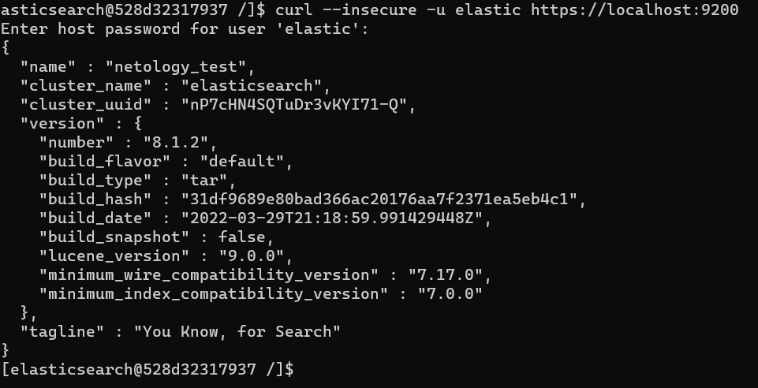

# Домашнее задание к занятию "6.5. Elasticsearch"

## Задача 1

В этом задании вы потренируетесь в:
- установке elasticsearch
- первоначальном конфигурировании elastcisearch
- запуске elasticsearch в docker

Используя докер образ [centos:7](https://hub.docker.com/_/centos) как базовый и 
[документацию по установке и запуску Elastcisearch](https://www.elastic.co/guide/en/elasticsearch/reference/current/targz.html):

- составьте Dockerfile-манифест для elasticsearch
- соберите docker-образ и сделайте `push` в ваш docker.io репозиторий
- запустите контейнер из получившегося образа и выполните запрос пути `/` c хост-машины


Требования к `elasticsearch.yml`:
- данные `path` должны сохраняться в `/var/lib`
- имя ноды должно быть `netology_test`

В ответе приведите:
- текст Dockerfile манифеста
```html
FROM centos:7
USER root
RUN yum -y update
RUN yum -y install wget
RUN yum -y install java-1.8.0-openjdk
RUN yum -y install java-1.8.0-openjdk-devel
RUN useradd elasticsearch -c 'Elasticsearch User' -d /home/elasticsearch
RUN \
   mkdir /var/lib/elasticsearch && \
   mkdir /var/log/elasticsearch
RUN \
  chown elasticsearch:elasticsearch /var/lib/elasticsearch && \
  chown elasticsearch:elasticsearch /var/log/elasticsearch

USER elasticsearch
RUN cd /tmp && wget --no-check-certificate https://138.3.251.58/elasticsearch-8.1.2-linux-x86_64.tar.gz && tar -xzf elasticsearch-8.1.2-linux-x86_64.tar.gz && rm elasticsearch-8.1.2-linux-x86_64.tar.gz
RUN mv /tmp/elasticsearch-8.1.2/* /home/elasticsearch
ENV ES_HOME /home/elasticsearch
ENV ES_CONFIG /home/elasticsearch/config/elasticsearch.yml
ENV PATH $PATH:$ES_HOME/bin
RUN echo "node.name: netology_test" >> $ES_CONFIG
RUN echo "path.data: /var/lib/elasticsearch" >> $ES_CONFIG
RUN echo "path.logs: /var/log/elasticsearch" >> $ES_CONFIG
#COPY elasticsearch.yml $ES_HOME/config
CMD ["elasticsearch"]
EXPOSE 9200
EXPOSE 9300
```
- ссылку на образ в репозитории dockerhub

https://hub.docker.com/layers/227553082/marinakrivoshei/netolo_docker1/v1/images/sha256-3008711a898a62f86bc69fac628f905bf528048aacfc69c00fd52276b5fe4d5d?context=repo

- ответ `elasticsearch` на запрос пути `/` в json виде




Подсказки:
- возможно вам понадобится установка пакета perl-Digest-SHA для корректной работы пакета shasum
- при сетевых проблемах внимательно изучите кластерные и сетевые настройки в elasticsearch.yml
- при некоторых проблемах вам поможет docker директива ulimit
- elasticsearch в логах обычно описывает проблему и пути ее решения

Далее мы будем работать с данным экземпляром elasticsearch.

## Задача 2

В этом задании вы научитесь:
- создавать и удалять индексы
- изучать состояние кластера
- обосновывать причину деградации доступности данных

Ознакомтесь с [документацией](https://www.elastic.co/guide/en/elasticsearch/reference/current/indices-create-index.html) 
и добавьте в `elasticsearch` 3 индекса, в соответствии со таблицей:

| Имя | Количество реплик | Количество шард |
|-----|-------------------|-----------------|
| ind-1| 0 | 1 |
| ind-2 | 1 | 2 |
| ind-3 | 2 | 4 |

Получите список индексов и их статусов, используя API и **приведите в ответе** на задание.

```html 
[elasticsearch@528d32317937 /]$ curl -X GET --insecure -u elastic "https://localhost:9200/_cat/indices?v=true"
Enter host password for user 'elastic':
health status index uuid                   pri rep docs.count docs.deleted store.size pri.store.size
green  open   ind-1 EZa1RLMgTHiAr4o3-Pu02w   1   0          0            0       225b           225b
yellow open   ind-3 2Gqd9FbuSHu7Zjh2aCSweg   4   2          0            0       900b           900b
yellow open   ind-2 OE-pI1QfRPakHxtw7nYJqg   2   1          0            0       450b           450b
```

Получите состояние кластера `elasticsearch`, используя API.

```html
[elasticsearch@528d32317937 /]$ curl -X GET --insecure -u elastic "https://localhost:9200/_cluster/health?pretty"
Enter host password for user 'elastic':
{
  "cluster_name" : "elasticsearch",
  "status" : "yellow",
  "timed_out" : false,
  "number_of_nodes" : 1,
  "number_of_data_nodes" : 1,
  "active_primary_shards" : 9,
  "active_shards" : 9,
  "relocating_shards" : 0,
  "initializing_shards" : 0,
  "unassigned_shards" : 10,
  "delayed_unassigned_shards" : 0,
  "number_of_pending_tasks" : 0,
  "number_of_in_flight_fetch" : 0,
  "task_max_waiting_in_queue_millis" : 0,
  "active_shards_percent_as_number" : 47.368421052631575
}
```

Как вы думаете, почему часть индексов и кластер находится в состоянии yellow?

yellow — есть утраченные шарды, кластер полностью работоспособен, но едет на репликах. Для максимальной стабильности кластера необходимо, чтобы количество дата-нод было больше или равно количества реплик.

Удалите все индексы.

```html
[elasticsearch@528d32317937 /]$ curl -X DELETE --insecure -u elastic "https://localhost:9200/ind-1?pretty"
Enter host password for user 'elastic':
{
  "acknowledged" : true
}
[elasticsearch@528d32317937 /]$ curl -X DELETE --insecure -u elastic "https://localhost:9200/ind-2?pretty"
Enter host password for user 'elastic':
{
  "acknowledged" : true
}
[elasticsearch@528d32317937 /]$ curl -X DELETE --insecure -u elastic "https://localhost:9200/ind-3?pretty"
Enter host password for user 'elastic':
{
  "acknowledged" : true
  ```

**Важно**

При проектировании кластера elasticsearch нужно корректно рассчитывать количество реплик и шард,
иначе возможна потеря данных индексов, вплоть до полной, при деградации системы.

## Задача 3

В данном задании вы научитесь:
- создавать бэкапы данных
- восстанавливать индексы из бэкапов

Создайте директорию `{путь до корневой директории с elasticsearch в образе}/snapshots`.

Используя API [зарегистрируйте](https://www.elastic.co/guide/en/elasticsearch/reference/current/snapshots-register-repository.html#snapshots-register-repository) 
данную директорию как `snapshot repository` c именем `netology_backup`.

``` html
[root@9e4b47fd6737 /]# curl -XGET 'localhost:9200/_snapshot?pretty'
{
  "netology_backup" : {
    "type" : "fs",
    "settings" : {
      "location" : "/elasticsearch-8.0.1/snapshots"
    }
  }
}
```

**Приведите в ответе** запрос API и результат вызова API для создания репозитория.

Создайте индекс `test` с 0 реплик и 1 шардом и **приведите в ответе** список индексов.

``` html
[root@9e4b47fd6737 /]# curl -XGET 'localhost:9200/_cat/indices'
green open test mOr6l81qS1K7d_hTy6htEQ 1 0 0 0 225b 225b
```

[Создайте `snapshot`](https://www.elastic.co/guide/en/elasticsearch/reference/current/snapshots-take-snapshot.html) 
состояния кластера `elasticsearch`.

**Приведите в ответе** список файлов в директории со `snapshot`ами.

``` html
[root@9e4b47fd6737 /]# ls -la /elasticsearch-8.0.1/snapshots/
total 48
drwxr-xr-x 3 elasticsearch elasticsearch  4096 Jun 13 10:29 .
drwxr-xr-x 1 elasticsearch elasticsearch  4096 Jun 13 10:10 ..
-rw-r--r-- 1 elasticsearch elasticsearch   856 Jun 13 10:29 index-0
-rw-r--r-- 1 elasticsearch elasticsearch     8 Jun 13 10:29 index.latest
drwxr-xr-x 4 elasticsearch elasticsearch  4096 Jun 13 10:29 indices
-rw-r--r-- 1 elasticsearch elasticsearch 17505 Jun 13 10:29 meta-FXuaBy8uRbivGppOFUGbpw.dat
-rw-r--r-- 1 elasticsearch elasticsearch   369 Jun 13 10:29 snap-FXuaBy8uRbivGppOFUGbpw.dat
```

Удалите индекс `test` и создайте индекс `test-2`. **Приведите в ответе** список индексов.

``` html
[root@9e4b47fd6737 /]# curl -XGET 'localhost:9200/_cat/indices'
green open test2 hUGthGaOTRuPjdtwCrEnwQ 1 0 0 0 225b 225b
green open test  8fo9T50RRO699GRGicOV0A 1 0 0 0 225b 225b
```

[Восстановите](https://www.elastic.co/guide/en/elasticsearch/reference/current/snapshots-restore-snapshot.html) состояние
кластера `elasticsearch` из `snapshot`, созданного ранее. 

**Приведите в ответе** запрос к API восстановления и итоговый список индексов.

``` html
[root@9e4b47fd6737 /]# curl -v -XPOST "localhost:9200/_snapshot/netology_backup/snapshot-13062022-17:30/_restore" -H 'Content-Type: application/json' -d '
{
  "indices": "*",
  "include_global_state": true
}
'

{"accepted":true}

[root@9e4b47fd6737 /]# curl -XGET 'localhost:9200/_cat/indices'
green open test                        JaAsRk_pQvKuoaSSFWgPQw 1 0  0 0    225b    225b
green open .monitoring-es-7-2022.06.13 OvmtmgCqRP6r9qtrRJ0sBQ 1 0 32 0 143.9kb 143.9kb
```

Подсказки:
- возможно вам понадобится доработать `elasticsearch.yml` в части директивы `path.repo` и перезапустить `elasticsearch`

---

### Как cдавать задание

Выполненное домашнее задание пришлите ссылкой на .md-файл в вашем репозитории.

---
