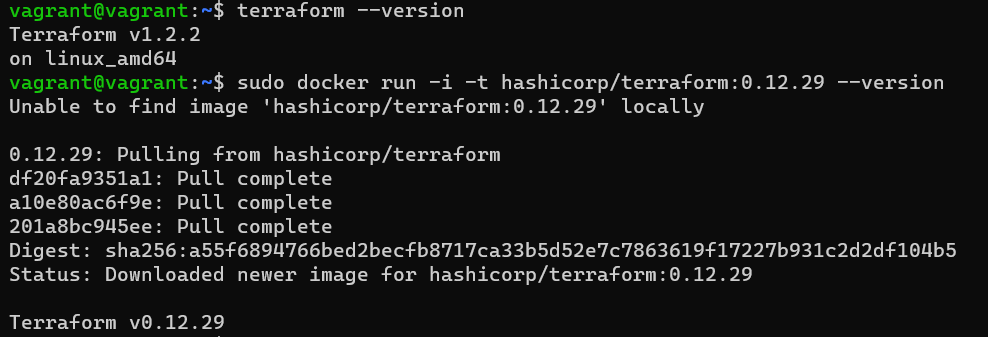

# Домашнее задание к занятию "7.1. Инфраструктура как код"

## Задача 1. Выбор инструментов. 
 
### Легенда.
 
Через час совещание на котором менеджер расскажет о новом проекте. Начать работу над которым надо 
будет уже сегодня. 
На данный момент известно, что это будет сервис, который ваша компания будет предоставлять внешним заказчикам.
Первое время, скорее всего, будет один внешний клиент, со временем внешних клиентов станет больше.

Так же по разговорам в компании есть вероятность, что техническое задание еще не четкое, что приведет к большому
количеству небольших релизов, тестирований интеграций, откатов, доработок, то есть скучно не будет.  
   
Вам, как девопс инженеру, будет необходимо принять решение об инструментах для организации инфраструктуры.
На данный момент в вашей компании уже используются следующие инструменты: 
- остатки Сloud Formation, 
- некоторые образы сделаны при помощи Packer,
- год назад начали активно использовать Terraform, 
- разработчики привыкли использовать Docker, 
- уже есть большая база Kubernetes конфигураций, 
- для автоматизации процессов используется Teamcity, 
- также есть совсем немного Ansible скриптов, 
- и ряд bash скриптов для упрощения рутинных задач.  

Для этого в рамках совещания надо будет выяснить подробности о проекте, что бы в итоге определиться с инструментами:

1. Какой тип инфраструктуры будем использовать для этого проекта: изменяемый или не изменяемый?

Возмжно использовать оба варианта, но при использовании изменяемого варианта нужно отслеживать все изменения. Более стабитьльно будет использовать неизменяемый тип.

2. Будет ли центральный сервер для управления инфраструктурой?

Для указанных условий он не требуется.

3. Будут ли агенты на серверах?

Без центрального сервера он не требуется.

4. Будут ли использованы средства для управления конфигурацией или инициализации ресурсов? 

С учетом частых обновлений и будущего расширения правильно будет использовать средства как для правления конфигурацией так и для  инициализации ресурсов.
 
В связи с тем, что проект стартует уже сегодня, в рамках совещания надо будет определиться со всеми этими вопросами.


### В результате задачи необходимо

1. Ответить на четыре вопроса представленных в разделе "Легенда".
2. Какие инструменты из уже используемых вы хотели бы использовать для нового проекта? 

год назад начали активно использовать Terraform - можно использовать его как инструмент инициализации, а для управления конфигурацией Ansible.

3. Хотите ли рассмотреть возможность внедрения новых инструментов для этого проекта? 

Т.к нет четкого плана развития проекта, то возможно рассмотреть внедрение новых инструментов.

Если для ответа на эти вопросы недостаточно информации, то напишите какие моменты уточните на совещании.


## Задача 2. Установка терраформ. 

Официальный сайт: https://www.terraform.io/

Установите терраформ при помощи менеджера пакетов используемого в вашей операционной системе.
В виде результата этой задачи приложите вывод команды `terraform --version`.

``` html
vagrant@vagrant:~$ terraform --version
Terraform v1.2.2
on linux_amd64
```

## Задача 3. Поддержка легаси кода. 

В какой-то момент вы обновили терраформ до новой версии, например с 0.12 до 0.13. 
А код одного из проектов настолько устарел, что не может работать с версией 0.13. 
В связи с этим необходимо сделать так, чтобы вы могли одновременно использовать последнюю версию терраформа установленную при помощи
штатного менеджера пакетов и устаревшую версию 0.12. 

Установила устаревшую версию в Docker.

``` html
vagrant@vagrant:~$ terraform --version
Terraform v1.2.2
on linux_amd64
vagrant@vagrant:~$ sudo docker run -i -t hashicorp/terraform:0.12.29 --version
Unable to find image 'hashicorp/terraform:0.12.29' locally

0.12.29: Pulling from hashicorp/terraform
df20fa9351a1: Pull complete
a10e80ac6f9e: Pull complete
201a8bc945ee: Pull complete
Digest: sha256:a55f6894766bed2becfb8717ca33b5d52e7c7863619f17227b931c2d2df104b5
Status: Downloaded newer image for hashicorp/terraform:0.12.29

Terraform v0.12.29

```


В виде результата этой задачи приложите вывод `--version` двух версий терраформа доступных на вашем компьютере 
или виртуальной машине.

---

### Как cдавать задание

Выполненное домашнее задание пришлите ссылкой на .md-файл в вашем репозитории.

---
